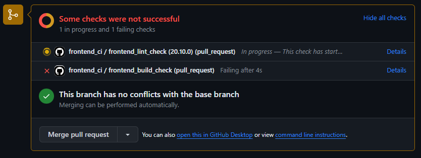

# TypeScript(Next.js)のCIをGitHub Actionsで構築してみる！ の写経
https://qiita.com/Senritsu420/items/f51a7eff81a8c1372302

## フロントエンドの作成
```
> npx create-next-app

√ What is your project named? ... frontend
√ Would you like to use TypeScript? ... No / Yes
√ Would you like to use ESLint? ... No / Yes
√ Would you like to use Tailwind CSS? ... No / Yes
√ Would you like to use `src/` directory? ... No / Yes
√ Would you like to use App Router? (recommended) ... No / Yes
√ Would you like to customize the default import alias (@/*)? ... No / Yes
√ What import alias would you like configured? ... @/*
```

## CIを動かす
・developブランチにPull Requestが作成されたときに発火  
  ⇒pathsでfrontendディレクトリの中身が編集されていれば実行とする  
・手動実行もしたいので workflow_dispatch をトリガーに追加  

その際に reviewdogというLintでNGの場合にチェックしてくれる  
脆弱性検査ツールのDockleも実行する  

## developブランチにPRを出すと
CIが走り


問題の箇所でエラーとなる

